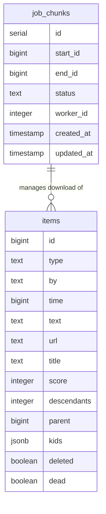

```mermaid
erDiagram
    items {
        bigint id
        text type
        text by
        bigint time
        text text
        text url
        text title
        integer score
        integer descendants
        bigint parent
        jsonb kids
        boolean deleted
        boolean dead
    }
    
    job_chunks {
        serial id
        bigint start_id
        bigint end_id
        text status
        integer worker_id
        timestamp created_at
        timestamp updated_at
    }
    
    job_chunks ||--o{ items : "manages download of"
```
