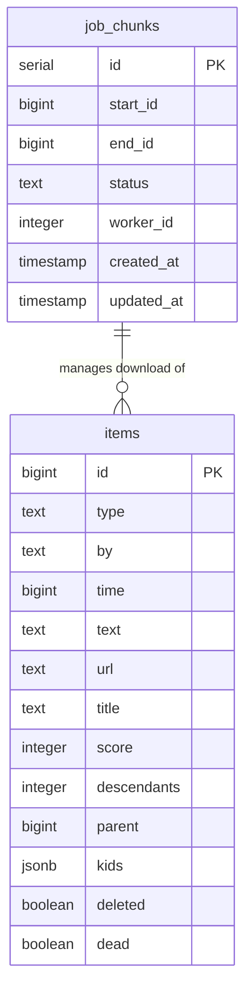

# Hacker News Data Scraper

A high-performance, parallelised data scraper that downloads the entire history of Hacker News items (stories, comments, jobs, etc.) and stores them in a local PostgreSQL database. Uses a resilient dispatcher/worker architecture for fast, efficient, and fault-tolerant downloading.

---

### Features

- **Parallel**: Uses Python's multiprocessing to run multiple worker processes, to better utilise network and CPU resources. This dramatically shortens the download time.

- **Asynchronous Workers**: Each worker uses asyncio and aiohttp to handle hundreds of concurrent API requests, dramatically increasing download speed.

- **Resilient Job Queue**: A PostgreSQL-backed job queue ensures that if the script is stopped or crashes, it can resume  where it left off with minimal data loss[^Lying] and no duplication.

[^Lying]:  The underway jobs from the job queue  will not be saved. If you're using a conservative chunk size (1 - 200), this won't be a significant amount.

- **Efficient Database Storage**: Uses batched database inserts to handle a high volume of writes efficiently.

- **Real-time Monitoring**: The dispatcher provides a live, updating progress bar showing the percentage of data chunks completed. Logs for each worker process are available.

- **Dockerised Database**: The PostgreSQL database runs in a Docker container for easy setup, portability, and clean-up. It's important you **set your environment variables before using this scraper.**


---

### Architecture

The system is built on a dispatcher/worker model, with instances of ***worker.py*** fetching from the API, and storing to the database :

**docker-compose.yml**: Defines and runs the PostgreSQL database service in a Docker container, ensuring a consistent and isolated environment.  

**dispatcher.py**: The main control script. On its first run, it creates the database tables, and populates a **job_chunks** table in the database with the entire range of Hacker News item IDs to be downloaded. It then launches (a default of 8) worker processes and monitors the overall progress.


**worker.py**:  Each worker process connects to the database, atomically claims a portion of the workload from the **job_chunks** table, ensuring no two instances download the same items from the API. They then use [asynchronous I/O](https://en.wikipedia.org/wiki/Asynchronous_I/O) ([Python docs](https://docs.python.org/3/library/asyncio.html)) to download all items in that range concurrently. The results are written to the database in large batches (you can vary the size). The entire database should be retrievable in a few hours, depending on your network speed. (for me this was ~3 hrs on 300 mbps connection with sensible settings).


---
### Prerequisites

Before you begin, ensure you have the following installed:

- [Git](https://git-scm.com/install/): For cloning the repository.

- [Python 3.10+:](https://www.python.org/downloads/) For running the scripts.

- [Docker](https://docs.docker.com/get-started/get-docker/): To run the PostgreSQL database container. 

### System Requirements

**Minimum**:

4 GB RAM
50 GB free disk space
Stable internet connection

**Recommended**:

8+ GB RAM
100+ GB disk space (for full history + indexes)
Multi-core CPU (4+ cores)

---
## Setup and Installation

1.  **Clone the Repository**

    ```bash

    git clone https://github.com/wayworm/hacker-news-analytics 
    cd hacker-news-analytics 

    ```

  

2.  **Install Python Dependencies**

    I recommended you use a [virtual environment](https://docs.python.org/3/library/venv.html).

    ```bash

    python3 -m venv venv

    source venv/bin/activate  # On Windows: venv\Scripts\activate

    pip install -r requirements.txt

    ```


 3. **Environment Variables**

Create a `.env` file in the project root (copy from `.example-env`):
```bash
cp .example-env .env
```

Then edit `.env` with your database credentials:
```
POSTGRES_USER=exampleuser
POSTGRES_PASSWORD=examplepassword
POSTGRES_DB=hacker_news
POSTGRES_HOST=localhost
POSTGRES_PORT=5432
```


4.  **Start the Database Server**

    This command will download the PostgreSQL image and start the database container in the background.

    ```bash

    docker-compose up -d

    ```

---

## How to Run


The entire process is managed by the dispatcher script.  

1.  **Start the Download**

    From the project directory, run the dispatcher. It will automatically populate the job queue on the first run and then launch the workers.

```bash 
    python dispatcher.py 
```

 Here are the arguments it can take:

```bash 
    python dispatcher.py --log True

    python dispatcher.py --reset-db  True  # Be warned, deletes all your data

    python dispatcher.py --num-workers 10

    python dispatcher.py --chunk-size 600

    python dispatcher.py --batch-size 300 
```


2.  **Stopping the Download**

    Press `Ctrl+C` in your terminal to stop the download. Progress is automatically saved to the database, and you can resume by running `dispatcher.py` again.


3.  **Resetting the Database**

    If you want to start the download from scratch and delete all existing data, use the `--reset-db` flag.

    ```bash

    python dispatcher.py --reset-db

    ```


---  

## Configuration

You can tune the performance by adjusting **batch size, chunk size and number of workers** with the CLI.


       `NUM_WORKERS`: The number of worker processes to launch. A good starting point is 1.5x the number of your CPU cores.

       `CHUNK_SIZE`: The number of item IDs in each job. Larger chunks mean less job management overhead. If they're too large, you do risk needed to redownload a significant amount of data if an error occurs, the data is only saved when a working finishes the chunk.

       `BATCH_SIZE`: The number of downloaded items to collect in memory before writing them to the database in a single batch. Larger batches are more efficient.

  

---

## Performance  

On a typical setup (4-core CPU, 100 Mbps connection):

- **Download speed:** ~500-1000 items/second

- **Time to completion:** ~1-4 hours for full history

- **Database size:** ~50+ GB (varies with indexes and data volume)

---


## Database Management

You can connect to your database to view the data using any standard SQL client, like **[DBeaver](https://dbeaver.io/)** or **[pgAdmin](https://www.pgadmin.org/)**.

### Data Schema


### Data Schema

\```

The `items` table contains:
- `id`: Unique item identifier (bigint)
...


The `items` table contains:

- `id`: Unique item identifier (bigint)

- `type`: Item type (story, comment, job, poll, pollopt)

- `by`: Username of submitter

- `time`: Unix timestamp

- `text`: Content (for comments)

- `title`: Title (for stories)

- `url`: External link (for stories)

- `score`: Points

- `kids`: JSONB array of child item IDs

- `deleted`: Boolean flag

- `dead`: Boolean flag  


---

  

## References

- [Hacker News API Documentation](https://github.com/HackerNews/API)

- [PostgreSQL](https://www.postgresql.org/)

- [DBeaver](https://dbeaver.io/)

- [Docker](https://www.docker.com/)

---  

## Acknowledgments


- Thanks to the Hacker News team for providing a free, open API!
